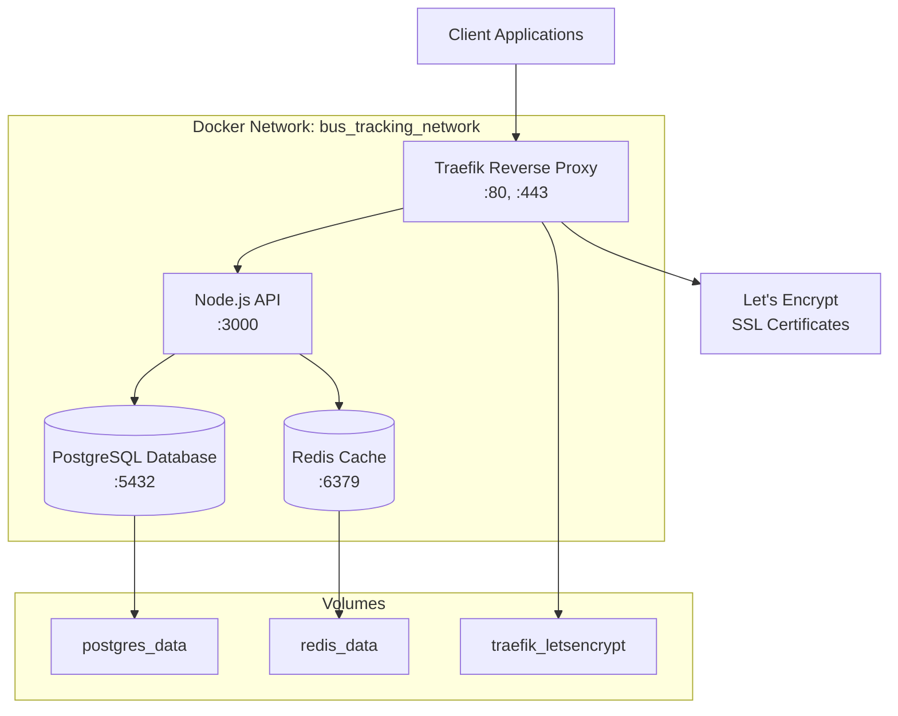
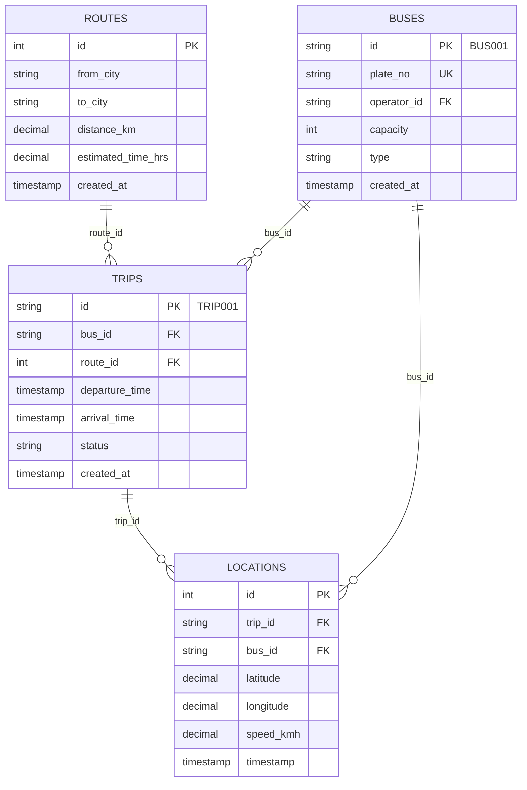

# 🚌 Real-Time Bus Tracking System API

<div align="center">

[](https://nodejs.org/)
[](https://expressjs.com/)
[](https://postgresql.org/)
[](https://redis.io/)
[](https://docker.com/)
[](https://traefik.io/)
[](LICENSE)

**A production-ready RESTful API for real-time bus tracking with automated HTTPS, reverse proxy, and scalable architecture**

[🚀 Quick Start](#-quick-start) • [📖 API Docs](#-api-documentation) • [🔒 Security](#-security--authentication) • [🐳 Docker](#-docker-deployment) • [🌐 Production](#-production-deployment)

</div>

---

## 📋 Table of Contents

- [✨ Features](#-features)
- [🏗️ System Architecture](#️-system-architecture)
- [🛠️ Technology Stack](#️-technology-stack)
- [🚀 Quick Start](#-quick-start)
- [📖 API Documentation](#-api-documentation)
- [🔒 Security & Authentication](#-security--authentication)
- [🗄️ Database Schema](#️-database-schema)
- [🐳 Docker Deployment](#-docker-deployment)
- [🌐 Production Deployment](#-production-deployment)
- [🔐 HTTPS & SSL Configuration](#-https--ssl-configuration)
- [⚡ Performance & Caching](#-performance--caching)
- [🧪 Testing](#-testing)
- [🔧 Development](#-development)
- [📞 Support](#-support)

---

## ✨ Features

### 🚌 **Core Functionality**
- **Real-time Bus Tracking** with GPS coordinates and speed monitoring
- **Route Management** with distance calculation and time estimation
- **Trip Scheduling** with automated arrival time calculation
- **Fleet Management** with bus capacity and type tracking
- **Location History** with comprehensive tracking records

### 🔐 **Security & Authentication**
- **JWT-based Authentication** with secure token generation
- **Role-based Access Control (RBAC)** - Admin, Operator, Commuter roles
- **Input Validation** with comprehensive data sanitization
- **SQL Injection Protection** with parameterized queries
- **Rate Limiting** and request throttling (planned)

### 🏗️ **Production Features**
- **Automated HTTPS** with Let's Encrypt SSL certificates
- **Reverse Proxy** with Traefik for load balancing
- **Redis Caching** for high-performance location data
- **Database Connection Pooling** for optimal performance
- **Container Orchestration** with Docker Compose
- **Health Monitoring** with comprehensive status endpoints

### 🌐 **API Features**
- **RESTful Design** following industry standards
- **Comprehensive CRUD Operations** for all resources
- **Advanced Filtering** with pagination and search
- **Real-time Updates** via Redis caching
- **Error Handling** with detailed HTTP status codes

---

## 🏗️ System Architecture



### **Data Flow**
1. **Client Request** → Traefik Proxy (HTTPS termination)
2. **Route Matching** → API Container (Load balancing)
3. **Authentication** → JWT Token validation
4. **Authorization** → Role-based access control
5. **Data Processing** → PostgreSQL queries + Redis caching
6. **Response** → JSON API response with proper HTTP codes

---

## 🛠️ Technology Stack

### **Backend Framework**
-  **Node.js 18.x** - Runtime environment
-  **Express.js 4.x** - Web framework
-  **JSON Web Tokens** - Authentication

### **Database & Caching**
-  **PostgreSQL 15** - Primary database
-  **Redis 7** - Caching and session storage

### **Infrastructure & DevOps**
-  **Docker Compose** - Container orchestration
-  **Traefik v2.10** - Reverse proxy & load balancer
-  **Let's Encrypt** - Free SSL certificates

### **Development Tools**
-  **GitHub Actions** - Automated deployment
-  **Postman Collection** - API testing suite

---

## 🚀 Quick Start

### **Prerequisites**
-  Docker 20.x or higher
-  Docker Compose 2.x or higher
- Domain name pointing to your server (for HTTPS)

### **🐳 Production Deployment (Recommended)**

1. **Clone the repository**
   ```bash
   git clone https://github.com/your-username/Real-Time-Bus-Tracking-System-API-NodeJS-.git
   cd Real-Time-Bus-Tracking-System-API-NodeJS-
   ```

2. **Configure environment variables**
   ```bash
   cp .env.example .env
   # Edit .env with your production values
   nano .env
   ```

3. **Update domain configuration**
   ```bash
   # Edit docker-compose.yml
   # Change subdomain.duckdns.org to your domain
   nano docker-compose.yml
   ```

4. **Deploy with HTTPS**
   ```bash
   docker-compose up -d
   ```

5. **Verify deployment**
   ```bash
   # Check all services are running
   docker-compose ps
   
   # Check API health
   curl https://your-domain.com/health
   ```

### **🔧 Development Setup**

```bash
# Use development configuration
docker-compose -f docker-compose.dev.yml up -d

# Access API locally
curl http://localhost:3000/health
```

---

## 📖 API Documentation

### **🔑 Authentication Endpoints**

#### **Login**
```http
POST /auth/login
Content-Type: application/json

{
  "email": "admin@ntc.gov.lk",
  "password": "adminpass"
}
```

**Response:**
```json
{
  "token": "eyJhbGciOiJIUzI1NiIs...",
  "role": "admin"
}
```

### **🛣️ Routes Management**

#### **Get All Routes** (Public)
```http
GET /routes?from=Colombo&to=Kandy&page=1&limit=10
Authorization: Bearer <token>
```

**Response:**
```json
{
  "routes": [
    {
      "id": 1,
      "from_city": "Colombo",
      "to_city": "Kandy",
      "distance_km": 115,
      "estimated_time_hrs": 3.5,
      "created_at": "2024-01-15T10:30:00Z"
    }
  ],
  "total": 1,
  "page": 1,
  "totalPages": 1
}
```

#### **Create Route** (Admin only)
```http
POST /routes
Authorization: Bearer <admin_token>
Content-Type: application/json

{
  "from_city": "Colombo",
  "to_city": "Jaffna",
  "distance_km": 396,
  "estimated_time_hrs": 8.0
}
```

### **🚌 Bus Management**

#### **Get All Buses** (Operator/Admin)
```http
GET /buses?operatorId=op1&page=1&limit=20
Authorization: Bearer <token>
```

#### **Create Bus** (Operator/Admin)
```http
POST /buses
Authorization: Bearer <operator_token>
Content-Type: application/json

{
  "plate_no": "CBZ-1234",
  "capacity": 45,
  "type": "Semi-Luxury"
}
```

### **🚏 Trip Management**

#### **Get Trips for Route**
```http
GET /trips/routes/1/trips?startDate=2024-01-15&page=1&limit=10
Authorization: Bearer <token>
```

#### **Create Trip** (Operator/Admin)
```http
POST /trips
Authorization: Bearer <operator_token>
Content-Type: application/json

{
  "bus_id": "BUS001",
  "route_id": 1,
  "departure_time": "2024-01-15T08:00:00Z"
}
```

### **📍 Location Tracking**

#### **Get Current Trip Location** (Public)
```http
GET /trips/TRIP001/location
Authorization: Bearer <token>
```

#### **Update Bus Location** (Operator only)
```http
POST /buses/BUS001/location
Authorization: Bearer <operator_token>
Content-Type: application/json

{
  "latitude": 6.9271,
  "longitude": 79.8612,
  "speed_kmh": 45.5
}
```

#### **Get Location History** (Operator/Admin)
```http
GET /buses/BUS001/locations/history?from=2024-01-15T00:00:00Z&limit=50
Authorization: Bearer <token>
```

---

## 🔒 Security & Authentication

### **🎭 User Roles & Permissions**

| **Role** | **Routes** | **Buses** | **Trips** | **Locations** |
|----------|------------|-----------|-----------|---------------|
| **👑 Admin** | Full CRUD | View + Manage | View + Manage | View History |
| **🚌 Operator** | View Only | Own Buses CRUD | Own Trips CRUD | Update + History |
| **👤 Commuter** | View Only | View Individual | View Only | View Current |

### **🔐 Sample User Credentials**

```javascript
// Admin User
{
  "email": "admin@ntc.gov.lk",
  "password": "adminpass",
  "role": "admin"
}

// Operator User
{
  "email": "operator1@example.com", 
  "password": "oppass",
  "role": "operator",
  "operatorId": "op1"
}

// Commuter User
{
  "email": "commuter1@example.com",
  "password": "commuterpass", 
  "role": "commuter"
}
```

### **🛡️ Security Features**

- **JWT Token Expiry**: 1 hour (configurable)
- **Password Hashing**: bcrypt with salt rounds
- **Input Validation**: Comprehensive data sanitization
- **SQL Injection Protection**: Parameterized queries only
- **Rate Limiting**: Planned implementation
- **CORS**: Configurable cross-origin policies

---

## 🗄️ Database Schema

### **📊 Entity Relationship Diagram**



### **🏗️ Table Definitions**

#### **Routes Table**
```sql
CREATE TABLE routes (
    id SERIAL PRIMARY KEY,
    from_city VARCHAR(100) NOT NULL,
    to_city VARCHAR(100) NOT NULL,
    distance_km DECIMAL(8,2) NOT NULL CHECK (distance_km > 0),
    estimated_time_hrs DECIMAL(4,2) NOT NULL CHECK (estimated_time_hrs > 0),
    created_at TIMESTAMP DEFAULT CURRENT_TIMESTAMP
);

CREATE INDEX idx_routes_cities ON routes(from_city, to_city);
```

#### **Buses Table**
```sql
CREATE TABLE buses (
    id VARCHAR(10) PRIMARY KEY, -- BUS001, BUS002, etc.
    plate_no VARCHAR(20) NOT NULL UNIQUE,
    operator_id VARCHAR(50) NOT NULL,
    capacity INTEGER NOT NULL CHECK (capacity > 0),
    type VARCHAR(50) NOT NULL,
    created_at TIMESTAMP DEFAULT CURRENT_TIMESTAMP
);

CREATE INDEX idx_buses_operator ON buses(operator_id);
```

---

## 🐳 Docker Deployment

### **🏭 Production Configuration**

Our production setup uses a sophisticated multi-container architecture:

#### **Services Overview**

| **Service** | **Image** | **Purpose** | **Ports** |
|-------------|-----------|-------------|-----------|
| **Traefik** | `traefik:v2.10` | Reverse proxy, SSL termination | 80, 443 |
| **API** | `custom-build` | Node.js application | 3000 (internal) |
| **PostgreSQL** | `postgres:15-alpine` | Primary database | 5432 |
| **Redis** | `redis:7-alpine` | Caching layer | 6379 |

#### **🔗 Service Dependencies**

```yaml
# Service startup order
1. PostgreSQL Database
2. Redis Cache  
3. Node.js API (depends on DB + Redis)
4. Traefik Proxy (routes to API)
```

#### **📂 Volume Management**

```yaml
volumes:
  postgres_data:          # Database persistence
    driver: local
    
  redis_data:             # Cache persistence  
    driver: local
    
  traefik_letsencrypt:    # SSL certificate storage
    driver: local
```

### **🌐 Network Architecture**

```yaml
networks:
  bus_tracking_network:
    driver: bridge
    # All containers communicate through this isolated network
    # External access only through Traefik proxy
```

---

## 🌐 Production Deployment

### **☁️ AWS EC2 Deployment**

#### **🖥️ Server Requirements**

| **Component** | **Minimum** | **Recommended** |
|---------------|-------------|-----------------|
| **CPU** | 2 vCPUs | 4 vCPUs |
| **RAM** | 4GB | 8GB |
| **Storage** | 20GB SSD | 50GB SSD |
| **Network** | 1 Gbps | 5 Gbps |

#### **🚀 Deployment Steps**

1. **Launch EC2 Instance**
   ```bash
   # Ubuntu 22.04 LTS (recommended)
   # t3.large instance type
   # Configure security groups for ports 80, 443, 22
   ```

2. **Install Docker**
   ```bash
   # Update system
   sudo apt update && sudo apt upgrade -y
   
   # Install Docker
   curl -fsSL https://get.docker.com -o get-docker.sh
   sudo sh get-docker.sh
   sudo usermod -aG docker ubuntu
   
   # Install Docker Compose
   sudo curl -L "https://github.com/docker/compose/releases/latest/download/docker-compose-$(uname -s)-$(uname -m)" -o /usr/local/bin/docker-compose
   sudo chmod +x /usr/local/bin/docker-compose
   ```

3. **Configure Domain DNS**
   ```bash
   # Point your domain to EC2 public IP
   # A Record: subdomain.yourdomain.com → EC2_PUBLIC_IP
   ```

4. **Deploy Application**
   ```bash
   # Clone repository
   git clone https://github.com/your-username/Real-Time-Bus-Tracking-System-API-NodeJS-.git
   cd Real-Time-Bus-Tracking-System-API-NodeJS-
   
   # Configure environment
   cp .env.example .env
   nano .env  # Update with production values
   
   # Update domain in docker-compose.yml
   sed -i 's/subdomain.duckdns.org/subdomain.yourdomain.com/g' docker-compose.yml
   
   # Deploy
   docker-compose up -d
   ```

### **🤖 Automated Deployment with GitHub Actions**

#### **CI/CD Pipeline**

```yaml
# .github/workflows/deploy-to-ec2.yml
name: Deploy to EC2
on:
  push:
    branches: [release-V1.0]
  workflow_dispatch:

jobs:
  deploy:
    runs-on: ubuntu-latest
    environment: production
    
    steps:
      - uses: actions/checkout@v4
      
      - name: Deploy to EC2
        run: |
          ssh ${{ secrets.EC2_USER }}@${{ secrets.EC2_HOST }} << 'EOF'
            cd ~/bus-tracking
            git pull origin release-V1.0
            docker-compose down
            docker-compose up -d --build
          EOF
```

#### **Required GitHub Secrets**

| **Secret** | **Value** | **Description** |
|------------|-----------|-----------------|
| `EC2_HOST` | `your-ec2-ip` | EC2 public IP address |
| `EC2_USER` | `ubuntu` | SSH username |
| `EC2_SSH_KEY` | `-----BEGIN RSA...` | Private SSH key |

---

## 🔐 HTTPS & SSL Configuration

### **🌟 Automatic SSL with Let's Encrypt**

Our production setup includes **automatic HTTPS** configuration using Traefik and Let's Encrypt:

#### **🔧 Traefik Configuration**

```yaml
traefik:
  command:
    - "--certificatesresolvers.myresolver.acme.httpchallenge=true"
    - "--certificatesresolvers.myresolver.acme.httpchallenge.entrypoint=web"  
    - "--certificatesresolvers.myresolver.acme.email=youremail@example.com"
    - "--certificatesresolvers.myresolver.acme.storage=/letsencrypt/acme.json"
```

#### **📋 SSL Features**

- ✅ **Automatic Certificate Generation** - No manual SSL setup required
- ✅ **Auto-Renewal** - Certificates renewed before expiry  
- ✅ **HTTP to HTTPS Redirect** - Automatic secure redirects
- ✅ **TLS 1.2/1.3 Support** - Modern encryption standards
- ✅ **HSTS Headers** - HTTP Strict Transport Security
- ✅ **Certificate Storage** - Persistent certificate storage

#### **🔍 SSL Verification**

```bash
# Check SSL certificate status
openssl s_client -connect subdomain.yourdomain.com:443 -servername subdomain.yourdomain.com

# Verify certificate chain
curl -I https://subdomain.yourdomain.com/health

# Check SSL Labs rating
# Visit: https://www.ssllabs.com/ssltest/
```

### **🛡️ Security Headers**

Traefik automatically adds security headers:

```http
Strict-Transport-Security: max-age=31536000; includeSubDomains
X-Content-Type-Options: nosniff
X-Frame-Options: DENY
X-XSS-Protection: 1; mode=block
```

---

## ⚡ Performance & Caching

### **🚀 Redis Caching Strategy**

#### **Location Data Caching**
```javascript
// Real-time location caching
await redisClient.set(`location:${tripId}`, JSON.stringify(location), 'EX', 3600);

// Cache expiry: 1 hour
// Hot data: Current trip locations
// Cold data: Historical locations (PostgreSQL)
```

#### **🔄 Cache Patterns**

| **Data Type** | **Cache Duration** | **Strategy** |
|---------------|-------------------|--------------|
| **Trip Locations** | 1 hour | Write-through |
| **Route Data** | 24 hours | Cache-aside |
| **Bus Status** | 5 minutes | Write-behind |
| **User Sessions** | 1 hour | Session store |

### **📊 Database Optimization**

#### **Indexing Strategy**
```sql
-- Performance indexes
CREATE INDEX idx_routes_cities ON routes(from_city, to_city);
CREATE INDEX idx_buses_operator ON buses(operator_id);
CREATE INDEX idx_trips_route_bus ON trips(route_id, bus_id);
CREATE INDEX idx_locations_trip_timestamp ON locations(trip_id, timestamp DESC);
CREATE INDEX idx_locations_bus_timestamp ON locations(bus_id, timestamp DESC);
```

#### **Connection Pooling**
```javascript
// PostgreSQL connection pool
const pool = new Pool({
  host: process.env.DB_HOST,
  port: process.env.DB_PORT,
  database: process.env.DB_NAME,
  user: process.env.DB_USER,
  password: process.env.DB_PASSWORD,
  max: 20,          // Maximum connections
  min: 5,           // Minimum connections  
  idleTimeoutMillis: 30000,
  connectionTimeoutMillis: 2000
});
```

---

## 🧪 Testing

### **🔍 Health Checks**

#### **API Health Endpoint**
```bash
# Basic health check
curl https://subdomain.yourdomain.com/health

# Expected response
{
  "status": "OK",
  "message": "Bus Tracking API is running",
  "timestamp": "2024-01-15T10:30:00Z"
}
```

#### **Service Health Monitoring**
```bash
# Check all containers
docker-compose ps

# Check container logs
docker-compose logs api
docker-compose logs postgres
docker-compose logs redis
docker-compose logs traefik
```

### **📬 Postman Collection Testing**

#### **Import Collection**
1. Download: `Real-Time-Bus-Tracking-API.postman_collection.json`
2. Import into Postman
3. Set environment: `Bus-Tracking-Local.postman_environment.json`

#### **Test Workflows**

```bash
# 1. Health Check
GET {{base_url}}/health

# 2. Authentication Flow  
POST {{base_url}}/auth/login
# → Saves token automatically

# 3. Routes Management
GET {{base_url}}/routes
POST {{base_url}}/routes  # Admin only

# 4. Bus Operations
GET {{base_url}}/buses    # Operator/Admin
POST {{base_url}}/buses   # Create new bus

# 5. Trip Management  
GET {{base_url}}/trips/routes/1/trips
POST {{base_url}}/trips   # Schedule trip

# 6. Location Tracking
POST {{base_url}}/buses/BUS001/location  # Update location
GET {{base_url}}/trips/TRIP001/location  # Get current location
```

### **🔧 Manual Testing Examples**

#### **Authentication Test**
```bash
# Login as admin
curl -X POST https://subdomain.yourdomain.com/auth/login \
  -H "Content-Type: application/json" \
  -d '{
    "email": "admin@ntc.gov.lk",
    "password": "adminpass"
  }'

# Use returned token
export TOKEN="eyJhbGciOiJIUzI1NiIs..."

# Test protected route
curl -H "Authorization: Bearer $TOKEN" \
  https://subdomain.yourdomain.com/routes
```

#### **Location Update Test**
```bash
# Update bus location (operator only)
curl -X POST https://subdomain.yourdomain.com/buses/BUS001/location \
  -H "Authorization: Bearer $OPERATOR_TOKEN" \
  -H "Content-Type: application/json" \
  -d '{
    "latitude": 6.9271,
    "longitude": 79.8612, 
    "speed_kmh": 45.5
  }'
```

---

## 🔧 Development

### **📁 Project Structure**

```
Real-Time-Bus-Tracking-System-API-NodeJS-/
├── 📁 .github/workflows/     # CI/CD pipelines
├── 📁 config/               # Database & Redis configuration
├── 📁 middleware/           # Authentication & authorization
├── 📁 routes/              # API endpoint definitions
│   ├── 🔐 auth.js          # Authentication endpoints  
│   ├── 🛣️ routes.js        # Route management
│   ├── 🚌 buses.js         # Bus fleet management
│   ├── 🚏 trips.js         # Trip scheduling
│   └── 📍 locations.js     # Location tracking
├── 📄 app.js               # Main application entry
├── 📄 Dockerfile           # Production container
├── 📄 Dockerfile.dev       # Development container  
├── 🐳 docker-compose.yml   # Production orchestration
├── 🐳 docker-compose.dev.yml # Development setup
├── 🗄️ init.sql            # Database initialization
├── 🔧 package.json         # Dependencies & scripts
├── ⚙️ .env.example         # Environment template
└── 📚 README.md            # This documentation
```

### **🛠️ Development Setup**

#### **Local Development**
```bash
# Clone repository
git clone https://github.com/your-username/Real-Time-Bus-Tracking-System-API-NodeJS-.git
cd Real-Time-Bus-Tracking-System-API-NodeJS-

# Start development environment
docker-compose -f docker-compose.dev.yml up -d

# Install dependencies (if running locally)
npm install

# Start development server
npm run dev  # Uses nodemon for hot reload
```

#### **🔍 Code Quality Standards**

- **ESLint**: Code linting and formatting
- **Prettier**: Code formatting
- **Joi**: Input validation schemas  
- **bcrypt**: Password hashing
- **helmet**: Security headers
- **cors**: Cross-origin resource sharing

### **📋 Environment Variables**

```bash
# Database Configuration
DB_HOST=postgres                    # Container name or IP
DB_PORT=5432                       # PostgreSQL port
DB_NAME=bus_tracking               # Database name
DB_USER=postgres                   # Database username  
DB_PASSWORD=secure_password        # Database password

# Redis Configuration  
REDIS_URL=redis://redis:6379       # Redis connection string

# JWT Configuration
JWT_SECRET=your-256-bit-secret     # JWT signing secret (generate new!)

# Application Configuration
PORT=3000                          # API port
NODE_ENV=production                # Environment mode
```

### **🤝 Contributing Guidelines**

1. **Fork** the repository
2. **Create** feature branch: `git checkout -b feature/amazing-feature`
3. **Commit** changes: `git commit -m 'Add amazing feature'`
4. **Push** to branch: `git push origin feature/amazing-feature`  
5. **Open** Pull Request with detailed description

#### **Code Standards**
- Write comprehensive tests for new features
- Follow existing code style and patterns
- Update documentation for API changes
- Ensure Docker builds successfully
- Test with Postman collection

---

## 📊 Monitoring & Observability

### **📈 Performance Metrics**

#### **Application Metrics**
- API response times
- Request throughput  
- Error rates
- Authentication success/failure rates

#### **Infrastructure Metrics**
- Container resource usage
- Database connection pool status
- Redis cache hit/miss ratios
- SSL certificate expiry dates

### **📋 Health Monitoring**

```bash
# Container health checks
docker-compose ps

# Resource usage monitoring
docker stats

# Log aggregation
docker-compose logs -f api
docker-compose logs -f postgres  
docker-compose logs -f redis
docker-compose logs -f traefik
```

---

## 🚀 Future Enhancements

### **🔄 Planned Features**

- [ ] **WebSocket Support** - Real-time location streaming
- [ ] **Push Notifications** - Trip status updates  
- [ ] **Route Optimization** - AI-powered route planning
- [ ] **Analytics Dashboard** - Usage and performance metrics
- [ ] **Mobile SDK** - Native mobile app integration
- [ ] **GraphQL API** - Alternative query interface
- [ ] **Microservices** - Service decomposition
- [ ] **Kubernetes** - Container orchestration upgrade

### **🔐 Security Enhancements**

- [ ] **OAuth2 Integration** - Third-party authentication
- [ ] **API Rate Limiting** - Request throttling  
- [ ] **Input Sanitization** - Enhanced XSS protection
- [ ] **Audit Logging** - Comprehensive activity logs
- [ ] **Penetration Testing** - Security vulnerability assessment

---

## 📞 Support

### **🐛 Issue Reporting**

Found a bug or have a feature request?

1. **Check existing issues**: [GitHub Issues](https://github.com/your-username/Real-Time-Bus-Tracking-System-API-NodeJS-/issues)
2. **Create new issue**: Use provided templates
3. **Provide details**: Steps to reproduce, expected behavior, environment info

### **📖 Documentation**

- **API Reference**: [Postman Documentation](https://documenter.getpostman.com/your-collection)
- **Docker Guide**: [Docker Hub](https://hub.docker.com/r/your-username/bus-tracking-api)
- **Deployment Guide**: [`DEPLOYMENT.md`](DEPLOYMENT.md)

### **💬 Community & Contact**

- **Email**: kusalcoc1212@gmail.com
- **GitHub**: [@your-username](https://github.com/your-username)
- **Issues**: [GitHub Issues](https://github.com/your-username/Real-Time-Bus-Tracking-System-API-NodeJS-/issues)

---

## 📜 License

This project is licensed under the **MIT License** - see the [LICENSE](LICENSE) file for details.

---

<div align="center">

**⭐ Star this repository if it helped you!**


**[🔝 Back to Top](#-real-time-bus-tracking-system-api)**

</div>